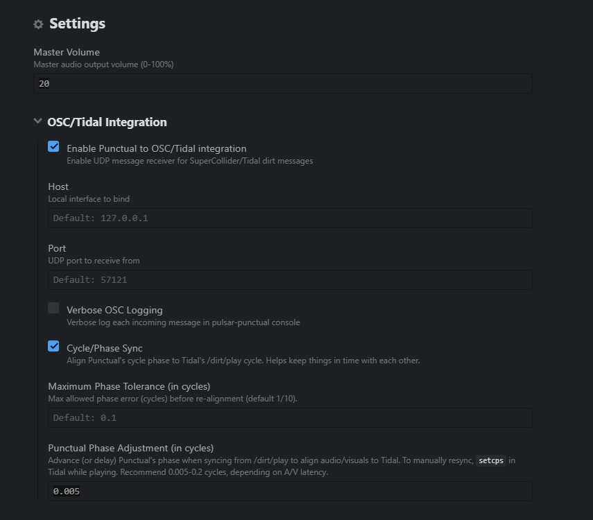

# Punctual Integration for Pulsar Editor

Punctual is a language for live coding audio and visuals. Pulsar is a fork of the dead Atom editor. `punctual-pulsar` integrates Punctual into Pulsar.

This is a work in progress. Bugs are to be expected. I hope they're minimal! 💜💜

## Features 
- Allows evaluation of punctual code in the Pulsar editor in `.punc` files, effectively a REPL. Effectively `atom-hydra` but for Punctual.
- Displays visuals in the Pulsar editor behind text.
- Integration with Tidalcycles/SuperCollider to sync tempo and cycles through `/dirt/play` for audio-reactive visuals.
- Ability to adjust punctual's phase slightly to account for imperfect timing between Punctual, Tidalcycles, and SuperCollider.
- (Planned) More robust OSC integration to allow more dynamic visuals based on code evaluated within tidalcycles' REPL.
- (Planned) Audio integration that isn't built on sticks and glue. ihatethebrowsersihateelectronihatetheweb

## Usage

1. Open or create a `.punc` file
2. Toggle the Punctual REPL with `Ctrl+Alt+P`. 
3. Evaluate code:
   - `Shift+Enter` - Evaluate current line
   - `Ctrl+Enter` - Evaluate current block (paragraph)
   - `Ctrl+Alt+Enter` - Evaluate all code
4. To sync CPS:
   - Punctual's cps will natively sync with tidalcycles' cps if beyond the configured tolerance and phase sync is enabled. You may force this by setting cps in tidalcycles, e.g. executing `setcps(120/60/4)` (perceived as 4/4 120bpm). 

There are some example functions in `punctual-examples.punc`.
In a `.punc` file, you may also just use the evaluate hotkey and Punctual will auto-enable and evaluate.

## Keybinds:
```
Shift+Enter          pulsar-punctual:evalLine               -- Evaluate Current Line
Ctrl+Enter           pulsar-punctual:evalBlock              -- Evaluate Current Block (Paragraph)
Ctrl+Alt+Enter       pulsar-punctual:evalCode               -- Evaluate Whole File
Ctrl+Alt+P           pulsar-punctual:toggle                 -- Toggle Punctual REPL
Ctrl+Shift+H         pulsar-punctual:toggleVisibility       -- Show/hide Pulsar UI (keeps Punctual visuals)
Ctrl+Alt+V             ^^^                                  -- alt keybind for toggling Pulsar UI
Ctrl+Alt+Up          pulsar-punctual:increaseMasterVolume   -- Increase master volume for punctual by 5.
Ctrl+Alt+Down        pulsar-punctual:decreaseMasterVolume   -- Decrease master volume for punctual by 5.
Ctrl+Alt+M           pulsar-punctual:panic                  -- Panic! Mute audio and kill visuals from Punctual.
```

## SuperCollider Integration
Add the following to your `startup.scd` to send OSC messages to pulsar-punctual:
```aiignore
(
    ~punctual = NetAddr("127.0.0.1", 57121);
    OSCdef(\forwardDirtPlay, { |msg, time|
        ~punctual.sendMsg(*msg);
    }, '/dirt/play', recvPort: 57120).permanent_(true);
);
```

Note that the port needs to respect the configuration options in Pulsar.

## Audio through SuperCollider
To get audio from Punctual and Tidalcycles to go through a single application, you can use [VB-Audio Virtual Cable](https://vb-audio.com/Cable/index.htm) on Windows.
Set the audio output of Pulsar to CABLE In, and the audio input of SuperCollider to CABLE Out.
Additionally, append the following in your `startup.scd`:

```scd
s.options.inDevice = "VB-Audio Virtual Cable";

(
    ~listenPulsar = {
        var sig = SoundIn.ar(0!2); // from virtual device
        Out.ar(0, sig * 0.8);
    }.play;
);
```

This is not resource-intensive. If you run into issues, I recommend investigating your SuperCollider server load and adjusting parameters accordingly.
One such easy optimization one can make is to enable lazy-loading of samples, particularly if you hoard samples like me:
```
~dirt.doNotReadYet = true;
```

## Configuration
The following configuaration options are currently available:




## Other Documentation

- [Punctual Reference](https://github.com/dktr0/Punctual/blob/main/REFERENCE.md) - Complete function reference
- [Punctual Visual Guide](https://punctual.savamala.top/) - Joan Queralt's comprehensive tutorial


## Inspiration/Kudos/Links
- [atom-hydra](https://github.com/hydra-synth/atom-hydra) by Olivia Jack (ojack)
- [tidalcycles](https://codeberg.org/uzu/tidal) by Alex McLean (yaxu)
- [pulsar-tidalcycles](https://github.com/tidalcycles/pulsar-tidalcycles) maintained by Andrea Bertagnolli (ndr-brt) 
- [Punctual](https://github.com/dktr0/Punctual) by David Ogborn (dktr0)
- [SuperCollider](https://supercollider.github.io/) 